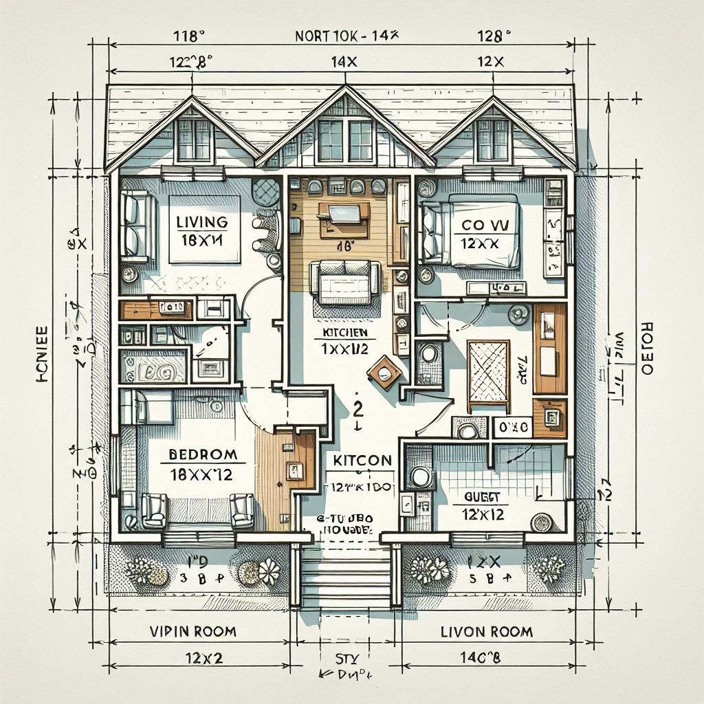

# 🏠 ArchiTech - AI-Powered Architectural Design


## 🏆 Reinventing Architectural Design

ArchiTech revolutionizes the way we approach architectural design by leveraging cutting-edge AI technology to generate professional floor plans instantly. Our solution bridges the gap between imagination and implementation, making architectural design accessible to everyone.



## ✨ Key Features

- **Instant Floor Plan Generation**: Create professional architectural floor plans with a simple text prompt
- **Customizable Designs**: Specify room numbers, types, and design preferences
- **Professional Output**: Generate industry-standard floor plans ready for further development
- **User-Friendly API**: Seamlessly integrate our technology into existing workflows

## 🧠 How It Works

ArchiTech uses OpenAI's DALL-E 3 model to transform text descriptions into detailed architectural floor plans. Our backend processes these requests through a robust Django API, delivering high-quality results in seconds.

```
Text Prompt → ArchiTech API → AI Processing → Professional Floor Plan
```

## 🛠️ Technology Stack

- **Backend**: Django REST Framework
- **AI Integration**: OpenAI API (DALL-E 3)
- **Image Processing**: Custom image enhancement pipeline
- **Deployment**: Cloud-based scalable architecture

## 🚀 Getting Started

### Prerequisites

- Python 3.8+
- Django
- OpenAI API key

### Installation

1. Clone the repository:
   ```bash
   git clone https://github.com/yourusername/ArchiTech.git
   cd ArchiTech
   ```

2. Install dependencies:
   ```bash
   pip install -r requirements.txt
   ```

3. Configure environment variables:
   - Create a `.env` file with your OpenAI API key
   - Set up Django settings

4. Run the server:
   ```bash
   python manage.py runserver
   ```

## 📖 Usage

### API Endpoints

- `POST /generate-house-map/`: Generate a floor plan with custom specifications
  
  Example request:
  ```json
  {
    "prompt": "A modern house with three bedrooms, two bathrooms, an open kitchen, and a home office",
    "style": "minimalist"
  }
  ```

## 🔮 Future Roadmap

### Immersive Visualization

- **AR Integration**: View generated floor plans in your actual space through augmented reality
- **VR Walkthrough**: Experience your future home in virtual reality before construction begins
- **Interactive 3D Models**: Manipulate and customize designs in three dimensions

### Blockchain Integration

- **Secure Design Ownership**: Register designs on blockchain for intellectual property protection
- **Smart Contracts**: Automate architectural approvals and contractor agreements
- **NFT Marketplaces**: Buy, sell, and trade unique architectural designs as digital assets

### AI Agent Enhancements

- **Autonomous Design Optimization**: AI that learns from user preferences to improve designs
- **Collaborative AI Architecture**: Multiple specialized AI agents working together on complex designs
- **Real-time Adaptation**: AI that can modify designs on-the-fly during client consultations

## 👥 Our Team

ArchiTech was created by a passionate team of developers, designers, and AI enthusiasts committed to transforming the architectural industry through technology.

## 📄 License

ArchiTech is MIT licensed, as found in the [LICENSE](./LICENSE) file.

---

<p align="center">Made with ❤️ for innovation in architecture</p>
```

## Contact
## 📬 Contact

- **Twitter**: [@tanishq497718](https://x.com/tanishq497718)
